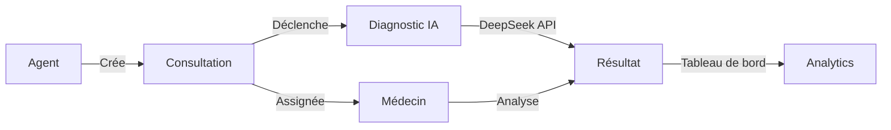
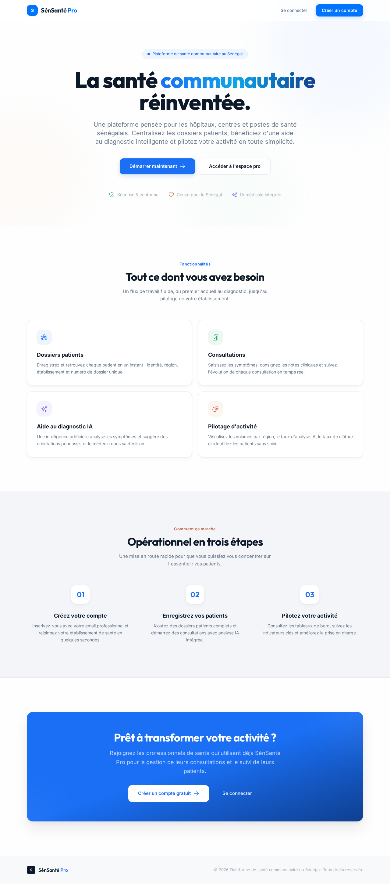
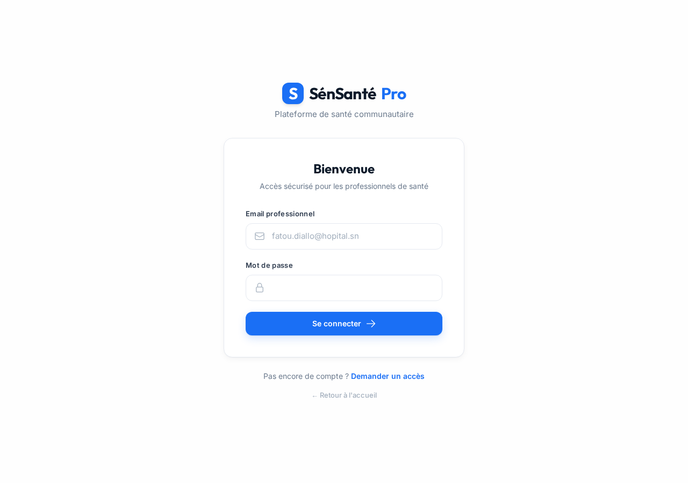
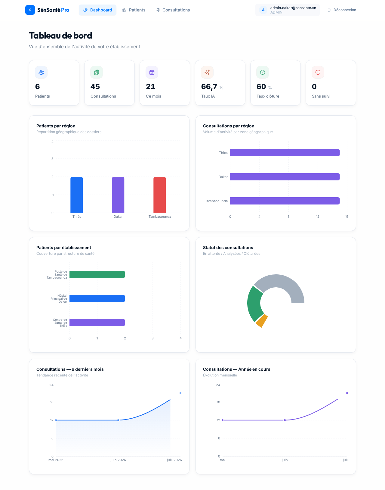
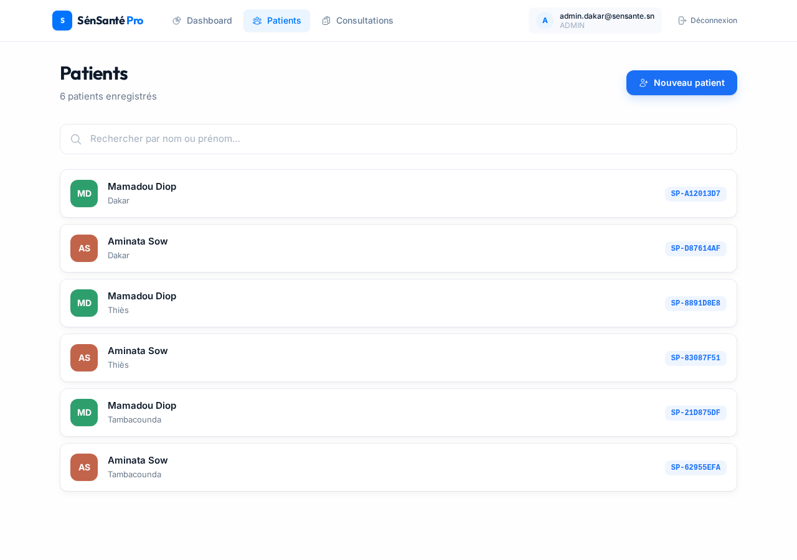
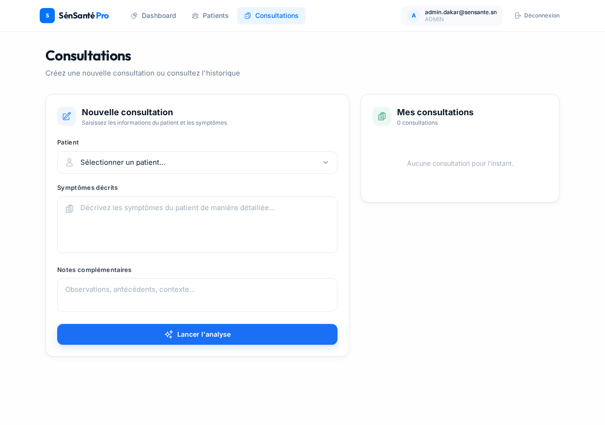
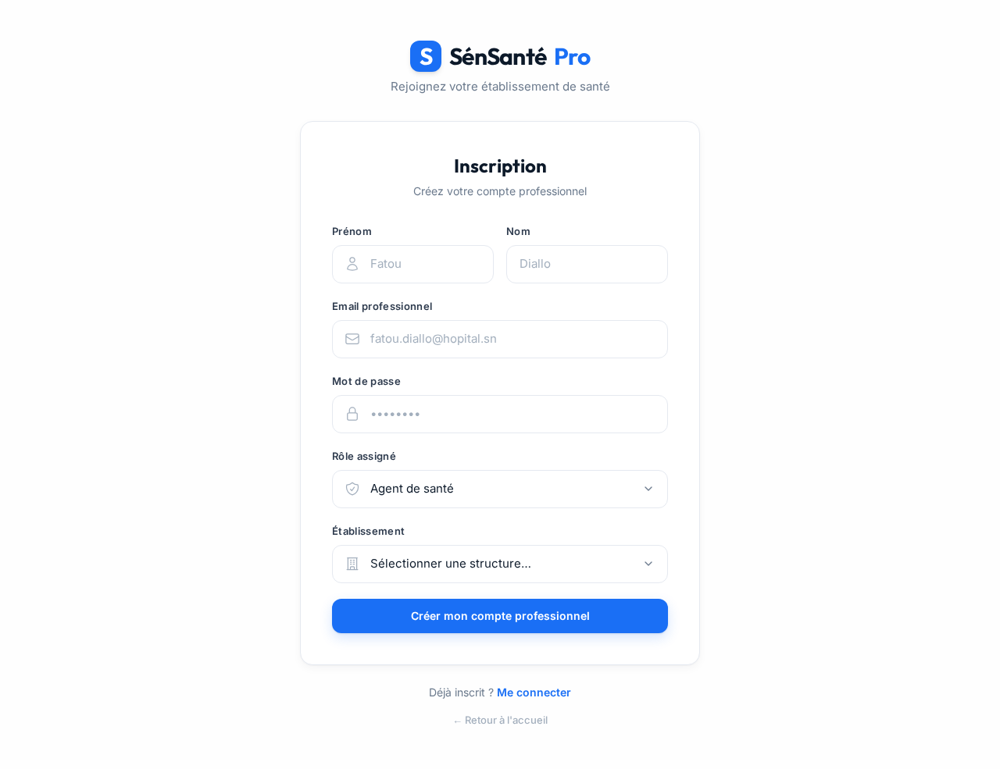
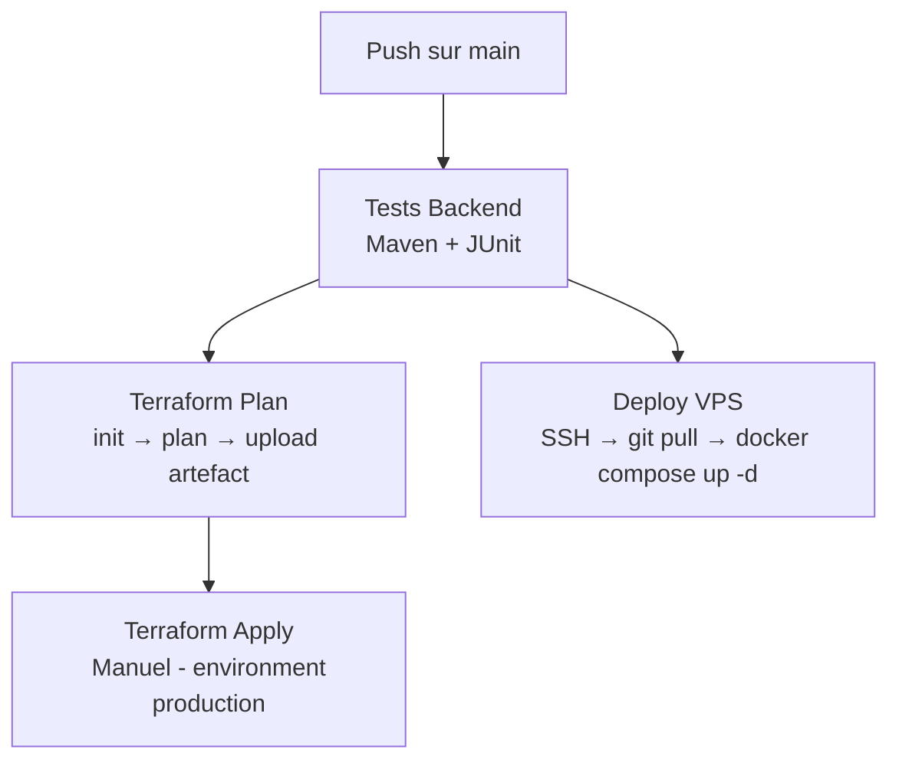
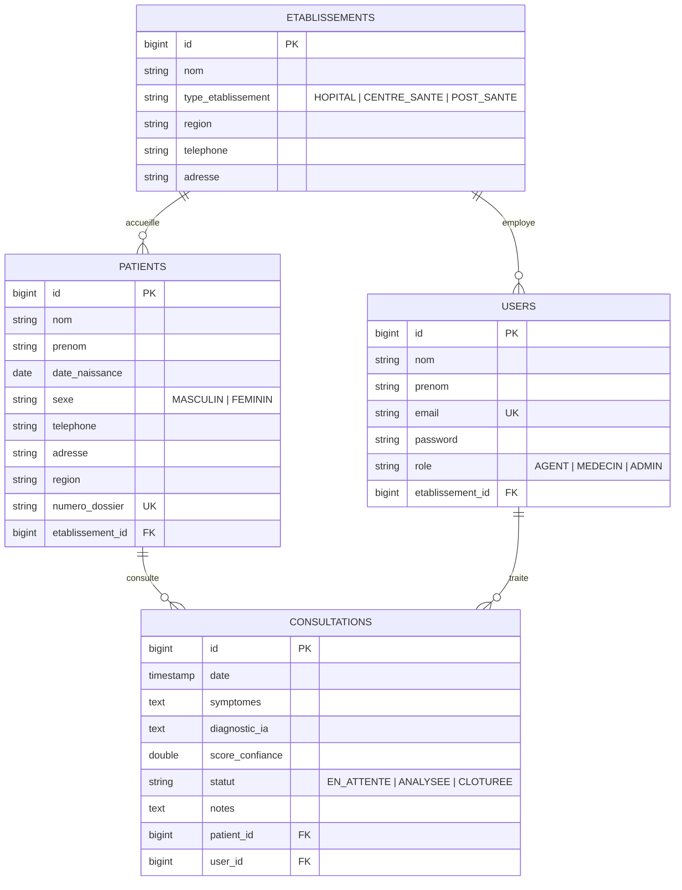

<br>
<p align="center">
  <picture>
    
  </picture>
</p>

<p align="center">
  <a href="https://github.com/ACADEMIC-AND-PERSONAL-PROJECTS/IPDL_v2/actions"></a>
  <a href="https://github.com/ACADEMIC-AND-PERSONAL-PROJECTS/IPDL_v2/blob/main/LICENSE"></a>
  
  
  
  
  
  
  
</p>

---

## Contexte

SénSanté Pro est une plateforme de gestion de consultations médicales destinée
aux établissements de santé sénégalais. Elle permet aux agents, médecins et
administrateurs de suivre les patients, créer des consultations et obtenir des
diagnostics assistés par intelligence artificielle.

Ce projet est né dans le cadre du module IPDL2 — Introduction au Processus de
Développement Logiciel du Master 1 IABD/GLSI à l'École Supérieure
Polytechnique (ESP) de l'Université Cheikh Anta Diop de Dakar, sous la
direction du Dr. El Hadji Bassirou TOURÉ.

Conçu initialement comme un projet de groupe sur 4 sprints SCRUM, je l'ai repris
individuellement après la fin du module pour le ré-adapter en profondeur :
migration de GitLab CI vers GitHub Actions, adoption de Spring AI en
remplacement du `RestTemplate` Groq d'origine, conteneurisation Docker
complète, provisioning Terraform, et intégration du modèle DeepSeek
plutôt que Groq.



## Stack technique

| Couche | Technologie |
|:---|:---|
| Backend | Spring Boot 4.1, Java 21, Spring Security 6, JWT (JJWT 0.12.6), Spring AI 2.0 |
| Frontend | React 19, Vite 8, Tailwind CSS, Axios, Recharts |
| Base de données | PostgreSQL 15 (dev & prod), H2 (tests) |
| IA | DeepSeek V4 Flash (via Spring AI OpenAI-compatible) |
| CI/CD | GitHub Actions — 5 jobs : tests, terraform plan, terraform apply, déploiement SSH |
| Conteneurisation | Docker multi-stage, Docker Compose (dev & prod) |
| IaC | Terraform 1.6 + provider Docker |
| Monitoring | Spring Boot Actuator (health endpoint) |

## Quick start

### Développement local

```bash
# 1. Base de données
docker compose up -d postgres

# 2. Backend (port 8080)
./mvnw spring-boot:run

# 3. Frontend (port 5173)
cd frontend && npm install && npm run dev
```

L'application est accessible sur `http://localhost:5173`. Le proxy Vite redirige
`/api/*` vers le backend. Comptes de test pré-initialisés :

| Rôle | Email | Mot de passe |
|:---|:---|---|
| Admin | `admin.dakar@sensante.sn` | `test123` |
| Médecin | `medecin.dakar@sensante.sn` | `test123` |
| Agent | `agent.dakar@sensante.sn` | `test123` |

### Production / Staging

```bash
# Copier et remplir les variables d'environnement
cp .env.example .env

# Build + démarrage
docker compose -f docker-compose.prod.yml up -d --build
```

### Terraform (alternative)

```bash
cd terraform
cp terraform.tfvars.example terraform.tfvars   # remplir les secrets
terraform init
terraform plan
terraform apply
```

## Aperçu

<p align="center">
  <sub>Landing Page — Page d'accueil publique</sub><br>
  
</p>

<p align="center">
  <sub>Connexion — Authentification JWT sécurisée</sub><br>
  
</p>

<p align="center">
  <sub>Tableau de bord — Analytics, graphiques, KPI par région et établissement</sub><br>
  
</p>

<details>
<summary> Plus de captures (Patients, Consultations, Inscription)</summary>

<p align="center">
  <sub>Patients — 6 patients pré-initialisés sur 3 établissements</sub><br>
  
</p>

<p align="center">
  <sub>Consultations — 45 consultations avec diagnostic IA</sub><br>
  
</p>

<p align="center">
  <sub>Inscription — Création de compte avec sélection d'établissement</sub><br>
  
</p>

</details>

## Structure du projet

```
IPDL_v2/
├── .github/workflows/
│   ├── ci-cd.yml              # Pipeline CI/CD complet (tests + terraform + deploy)
│   └── github-ci.yml          # Pipeline secondaire (PRs develop/main)
├── docs/
│   └── terraform.md           # Guide Terraform détaillé
├── frontend/                  # Application React 19 + Vite 8
│   ├── src/
│   │   ├── components/        # NavBar, Badge, DiagnosticIA, RouteProtegee…
│   │   ├── contexts/          # AuthContext (JWT management)
│   │   ├── pages/             # Landing, Login, Register, Dashboard, Patients, Consultations
│   │   └── services/          # Axios client, intercepteurs JWT
│   ├── Dockerfile             # Build multi-stage Node → Nginx
│   └── nginx.conf             # Reverse proxy /api → backend
├── src/main/java/com/example/demo/
│   ├── analytics/             # Statistiques (controller, service, DTO)
│   ├── auth/                  # Authentification JWT (login, register, filter)
│   ├── config/                # SecurityConfig, CorsConfig, DataInitializer, AiConfig
│   ├── consultation/          # CRUD consultations + diagnostic IA
│   ├── ia/                    # Service IA (DeepSeek via Spring AI)
│   └── patient/               # CRUD patients + établissements
├── terraform/                 # Infrastructure as Code
│   ├── main.tf                # 3 conteneurs (postgres, backend, frontend)
│   ├── variables.tf           # 8 variables dont 3 sensibles
│   └── outputs.tf             # URLs et IDs exposés
├── docker-compose.yml         # Environnement dev (postgres + pgadmin)
├── docker-compose.prod.yml    # Environnement prod (postgres + backend + frontend)
├── Dockerfile                 # Build multi-stage Spring Boot
├── init.sql                   # Schéma PostgreSQL pour déploiement frais
└── .env.example               # Modèle de variables d'environnement
```

## Pipeline CI/CD



Le pipeline GitHub Actions déclenche automatiquement les tests et le plan
Terraform à chaque push sur `main`. Le `terraform apply` et le déploiement VPS
sont déclenchés manuellement via l'environnement protégé `production`.

## Sprints SCRUM — Parcours académique

Le projet a été développé en suivant la méthodologie SCRUM sur 4 sprints :

| Sprint | Thématique | Livrables |
|:---|:---|:---|
| Sprint 0 | Setup & Environnement | Spring Boot, Git/GitLab Flow, CI/CD initial, JPA |
| Sprint 1 | Cœur de métier | Authentification JWT, CRUD Patients, CRUD Consultations |
| Sprint 2 | IA & Frontend | Intégration IA (Groq→DeepSeek), React, Dashboard |
| Sprint 3 | Analytics & CI/CD | Graphiques, Pipeline 4 stages, Docker multi-stage |
| Sprint 4 | Hardening & Livraison | Docker Compose, Terraform IaC, Microservices (découverte) |

## Schéma de base de données



## Compétences acquises

Ce projet a été une montée en compétence massive sur l'ensemble de la chaîne
DevOps et développement full-stack.

Git & GitHub. J'ai considérablement renforcé mon niveau. Git Flow, merge
requests, rebase interactif, résolution de conflits complexes, protection de
branches : tout le workflow collaboratif est maîtrisé. GitHub Actions est
devenu un réflexe, pas juste un outil de cours.

Spring Boot. J'avais de très solides fondations sur le framework, mais ce
projet m'a fait monter d'un cran supplémentaire. Sécurité JWT stateless,
architecture en couches, gestion des exceptions globale, validation,
projections JPA pour analytics, intégration de Spring AI avec le modèle
DeepSeek : je maîtrise désormais l'écosystème à un niveau professionnel.

GitHub Actions. J'avais des connaissances minimales au départ, je repars
avec une compétence opérationnelle solide. Pipeline CI/CD complet avec 5 jobs,
parallélisme, artefacts, environnements protégés, secrets.

Méthodologie SCRUM. Pour la première fois, j'ai mené un projet en
utilisant une méthodologie de gestion de projet structurée. J'ai très bien
saisi le rythme des sprints, la répartition des rôles (Stratège, Commandant,
Architecte Web), les cérémonies et les rétrospectives.

Lecture de documentation officielle. J'ai appris à lire la documentation
officielle d'une technologie plutôt que de m'attarder sur des vidéos très
longues. Aller directement à la source (Spring docs, HashiCorp docs, GitHub
Actions docs) m'a fait gagner un temps et une précision incomparables.

Docker & Terraform. J'ai poussé la conteneurisation multi-stage complète
(Spring Boot côté serveur, React/Nginx côté client) et découvert
l'Infrastructure as Code avec provisionnement Docker, gestion d'état et
variables sensibles.

## Perspectives — Version 2

Je compte ajouter un nouvel incrément jusqu'à aboutir à une version 2 incluant
un agent IA autonome capable d'interagir directement avec la base de données
et d'exécuter des actions :

- Agent conversationnel intégré au dashboard avec mémoire contextuelle
- Protocole MCP (Model Context Protocol) : l'agent IA pourra appeler des
  Tools pour interroger directement la base de données, exécuter des
  actions et présenter les résultats, sans passer par du SQL généré

---

<p align="center">
  <sub>Built with Java, React and DeepSeek AI — Dakar, 2026</sub>
</p>
